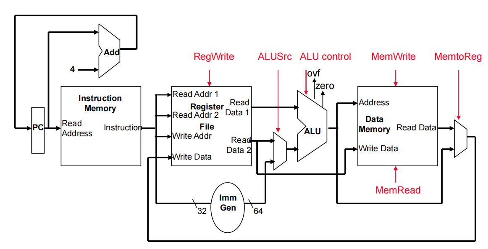
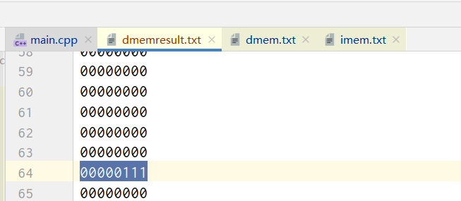

| 姓名 | 学号        | 时间      |
| ---- | ----------- | --------- |
| 董园 | 10205012469 | 2022-4-24 |

# 实验目的

用C++语言实现一个单周期RISC-V处理器的指令级模拟器。该模拟器支持RISC-V指令集的一个子集，并能对每条指令的执行进行建模。


# 实验步骤

## 文件说明

`main.cpp`：主程序

`imem.txt`：机器指令序列，以`halt`指令结尾

`dmem.txt`：数据区

`dmemresult.txt`

`RFresult`：寄存器值的情况


## 主程序执行过程



1. 取指
   - 根据PC的地址，向`IMem`中取指
   - 如果遇到`halt`指令，则结束
2. 解码
   - 根据指令获得相应控制信号
3. 读Register file
   - 根据解码获得的信息，读取相应寄存器中的数据
4. 执行ALU操作
   - 决定选通rs2还是立即数，并对立即数进行处理
   - 根据控制信号执行指令
5. 读取数据内存
   - 对于load/store指令，根据计算出的地址读取内存数据
6. 更新Register file
   - 如果控制信号`WrtEnable`
7. 更新PC
   - 判断需要+4还是+imm，更新PC

> 与理论课上讲的数据通路略有不同，此处PC更新的位置放在了周期的最后

## 类

### `RF`

#### 说明

```c++
// register file
class RF
{
public:
    bitset<64> ReadData1, ReadData2;
    // 构造函数
    RF();
    // 根据控制信号取值读取寄存器/写回寄存器
    void ReadWrite(bitset<5> RdReg1, bitset<5> RdReg2, bitset<5> WrtReg, bitset<64> WrtData, bitset<1> WrtEnable)
    // 将寄存器取值写入RFresult.txt
    void OutputRF();
private:
    // 寄存器组
    vector<bitset<64> > Registers;
}
```

#### 具体代码

```c++
class RF //register file
{
public:
    bitset<64> ReadData1, ReadData2;//预定义的数据类型，for eg bool->1byte(8位表示这个状态)，但是bitset可以直接操控一个二进制位
    RF()//构造函数
    {
        Registers.resize(32); //预设定有32个寄存器
        Registers[0] = bitset<64>(0);//把所有的位初始化为0
    }

    void ReadWrite(bitset<5> RdReg1, bitset<5> RdReg2, bitset<5> WrtReg, bitset<64> WrtData, bitset<1> WrtEnable) //WrtEnable 0 is read else is read and write
    {
        // TODO: implement!
        ReadData1 = Registers[RdReg1.to_ulong()];

        ReadData2 = Registers[RdReg2.to_ulong()];

        cout<<bitset<64>(ReadData1)<<' '<<bitset<64>(ReadData2)<<endl;

        if(WrtEnable.to_ulong()==1){
            Registers[WrtReg.to_ulong()] = WrtData;
        }
        cout<<Registers[WrtReg.to_ulong()]<<endl;
    }

    void OutputRF() {
        ofstream rfout;
        rfout.open("RFresult.txt", std::ios_base::app);//指定的库，namespace命名空间
        if (rfout.is_open()) {
            rfout << "A state of RF:" << endl; // << 类似于fprintf(fp,"A state of");把内容输出到指定文件里
            for (int j = 0; j < 32; j++) {
                rfout<<"reg"<<j<<':';
                rfout << Registers[j] << endl; //将每个寄存器输出到文件
            }

        } else cout << "Unable to open file";//否则输出打不开文件
        rfout.close(); //关闭流
    }
private:
    vector<bitset<64> > Registers;
};
```


### `ALU`

#### 说明

```c++
class ALU
{
    public:
    // 待返回的ALU结果
    bitset<64> ALUresult;
    // 执行ALU操作
     bitset<64> ALUOperation(bitset<3> ALUOP, bitset<64> oprand1, bitset<64> oprand2);
}
```

#### 具体代码

```c++
class ALU
{
public:
    bitset<64> ALUresult;
    bitset<64> ALUOperation(bitset<3> ALUOP, bitset<64> oprand1, bitset<64> oprand2)
    {
        // TODO: implement!
        if (ALUOP.to_string() == "000" || ALUOP.to_string() == "101")  // add/sd/ld
        {
            ALUresult = oprand1.to_ullong() + oprand2.to_ullong();//太大了会产生std:overflow_error
        }
        else if (ALUOP.to_string() == "001")  // sub
        {
            ALUresult = oprand1.to_ullong() - oprand2.to_ullong();
        }
        else if (ALUOP.to_string() == "010")  // and
        {
            ALUresult = oprand1 & oprand2;
        }
        else if (ALUOP.to_string() == "011")  // or
        {
            ALUresult = oprand1 | oprand2;
        }
        else if (ALUOP.to_string() == "011")  // xor
        {
            ALUresult = oprand1 ^ oprand2;
        }
        else if (ALUOP.to_string() == "110")  // jal
        {
            ;
        }
        return ALUresult;
    }
};
```


### `INSMem`

#### 说明

```c++
class INSMem
{
public:
    bitset<32> Instruction;
    // 构造函数
    INSMem();
    // 从指令内存中取指
    bitset<32> ReadMemory(bitset<32> ReadAddress);
private:
    vector<bitset<8> > IMem;
}
```


#### 具体代码

```c++
class INSMem
{
public:
    bitset<32> Instruction;
    INSMem()
    {
        IMem.resize(MemSize);
        ifstream imem;
        string line;
        int i = 0;
        imem.open("imem.txt");
        if (imem.is_open())
        {
            while (getline(imem, line))
            {
                IMem[i] = bitset<8>(line.substr(0, 8));
                i++;
            }

        }
        else cout << "Unable to open file1"<<endl;
        imem.close();

    }

    bitset<32> ReadMemory(bitset<32> ReadAddress)
    {
        // TODO: implement!
        // (Read the byte at the ReadAddress and the following three byte).
        unsigned int address = ReadAddress.to_ulong();
        for(int i = 0; i < 4; i++){
            for(int j = 0; j < 8; j++){
                cout<<IMem[address+i][7-j]<<' ';
                Instruction[31-(i*8+j)] = IMem[address+i][7-j];
            }
            cout<<endl;
        }

        return Instruction;
    }

private:
    vector<bitset<8>> IMem;

};
```


### `DataMem`

#### 说明

```c++
class DataMem
{
public:
    bitset<64> readdata;
    // 构造函数
    DataMem();
    // 根据控制信号readmem/writemem，访问Address对应地址的数据或向Address对应的内存地址写入数据
    bitset<64> MemoryAccess(bitset<64> Address, bitset<64> WriteData, bitset<1> readmem, bitset<1> writemem)
}
```


#### 具体代码

```c++
class DataMem
{
public:
    bitset<64> readdata;
    DataMem()
    {
        DMem.resize(MemSize);
        ifstream dmem;
        string line;
        int i = 0;
        dmem.open("dmem.txt");
        if (dmem.is_open())
        {
            while (getline(dmem, line))
            {
                DMem[i] = bitset<8>(line.substr(0, 8));
                i++;
            }
        }
        else cout << "Unable to open file2"<<endl;
        dmem.close();

    }
    bitset<64> MemoryAccess(bitset<64> Address, bitset<64> WriteData, bitset<1> readmem, bitset<1> writemem)
    {
        // TODO: implement!
        if(readmem[0] == 1){
            //返回address对应的数据
            string s;
            unsigned long long address = Address.to_ulong();
            for(int i = 0; i < 8; i++){
                //取八个字节的数据
                s.append(DMem[address+i].to_string());
            }
            bitset<64>data(s);
            readdata = data;
            return readdata;
        }

        if(writemem[0] == 1){//返回？
            //写到对应地址的位置
            unsigned long address = Address.to_ulong();
            for(int i = 0; i < 64; i++){//big-endian
                DMem[address+i/8][7-i%8] = WriteData[63-i];
            }
            return WriteData;
        }


    }

    void OutputDataMem()
    {
        ofstream dmemout;
        dmemout.open("dmemresult.txt");
        if (dmemout.is_open())
        {
            for (int j = 0; j < 100; j++)
            {
                dmemout << DMem[j] << endl;
            }

        }
        else cout << "Unable to open file";
        dmemout.close();

    }

private:
    vector<bitset<8> > DMem;

};
```


## 测试数据示例

C语言代码：

```c++
B[1] = A[i−j];
```

RISC-V代码：

将`i`存入x28，`j`存入x29，数组`A`的起始地址存入x10，数组`B`的起始地址存入x12.

```assembly
ld x29, 0(x0)  // j
ld x28, 8(x0)  // i
ld x10, 16(x0)  // &A
ld x12, 24(x0)  // &B
sub x30, x28, x29 	// compute i-j 
add x30, x30, x30		// multiply by 8 to convert the double word offset to a byte offset
add x30, x30, x30 
add x30, x30, x30		
add x10, x10, x30 
ld x30, 0(x10) 			// load A[i-j] 
sd x30, 8(x12) 		// store in B[1]
```

机器指令代码：

```tex
00000000
00000000
00111110
10000011
00000000
10000000
00111110
00000011
00000001
00000000
00110101
00000011
00000001
10000000
00110110
00000011
01000001
11011110
00001111
00110011
00000001
11101111
00001111
00110011
00000001
11101111
00001111
00110011
00000001
11101111
00001111
00110011
00000001
11100101
00000101
00110011
00000000
00000101
00111111
00000011
00000001
11100110
00110100
00100011
11111111
11111111
11111111
11111111
```


## 代码框架修改（部分）

1. 判断`fun3`时，比对`instruction.to_string().substr(17, 3)`而不是`(14,3)`

   

2. 判断imm的正负性时，比较`instruction[31]`而不是`PC[31]`

   

3. 判断imm的正负性时，比较`tmp[20]`而不是`tmp[52]`，`tmp`改为64位

   

4. `I-Type`指令包括`ld`指令（`opcode=0000011`）和`addi`指令（`opcode=0010011`）

   


# 实验结果

前四条`ld`指令执行后，Register file(`RFresult.txt`)结果如下：


可以看到，`&A=40,&B=64,i=2,j=1`。

根据`dmem.txt`，`A[1]=7`



执行程序，得到`B[1]=7`


